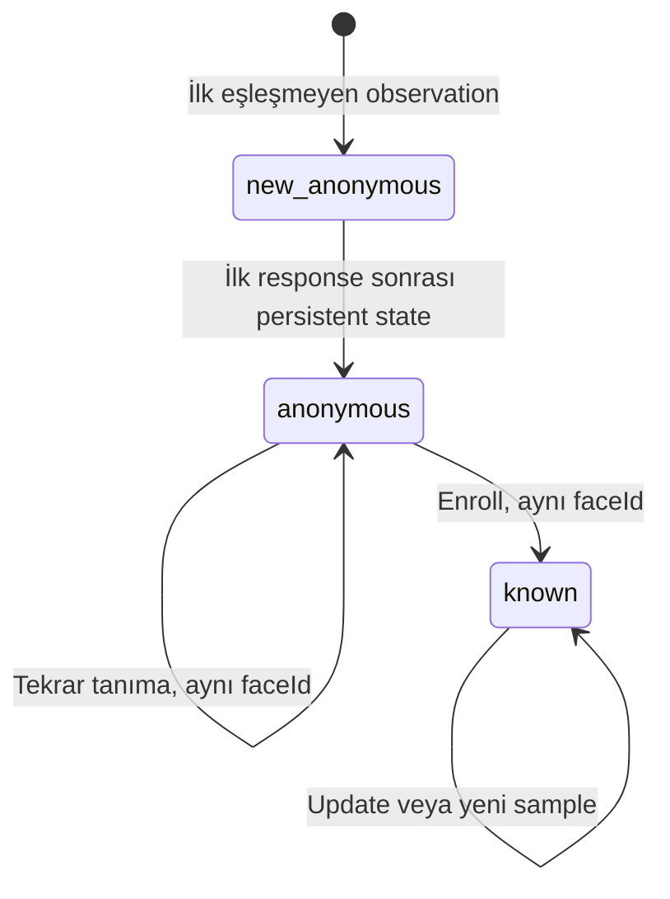
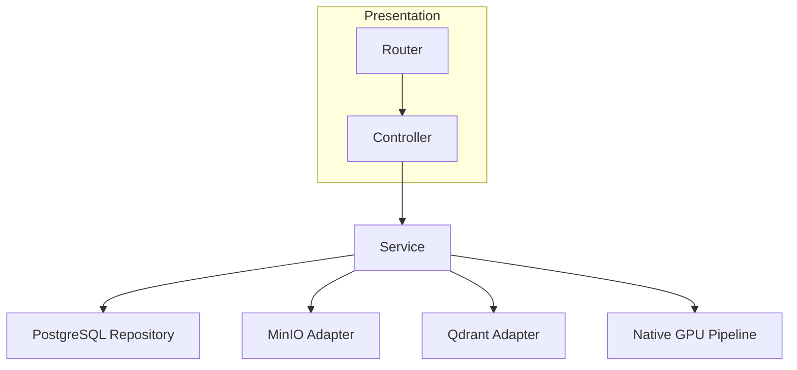
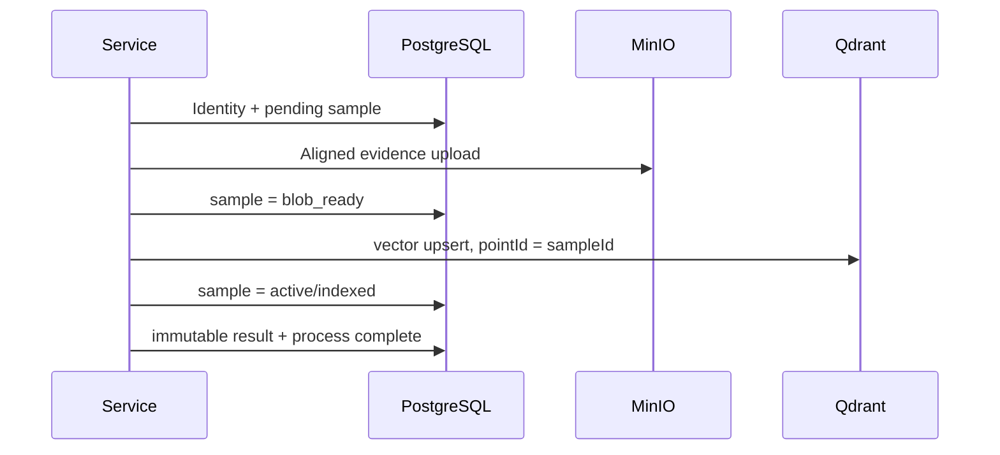
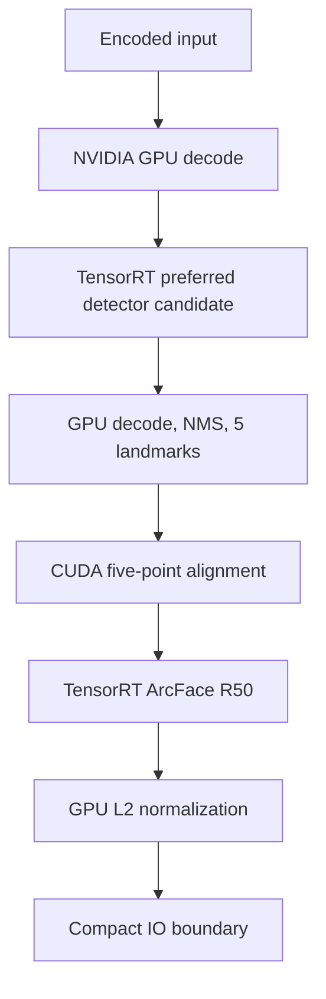

# MergenVision Agent Anayasası

Bu dosya, bulunduğu repository içindeki bütün agent çalışmalarını bağlar. Amacı agentın hızlı görünmek uğruna ürün davranışı, veri modeli, GPU hot path veya kanıt standardını keyfi biçimde değiştirmesini engellemektir.

Kullanıcının güncel ve açık talimatı bu dosyadan üstündür. Bunun dışında bu kurallar atlanamaz.

---

## 1. Dil, üslup ve temel davranış

- Kullanıcıyla iletişim, planlar ve raporlar Türkçe yazılır.
- Kod, identifier, API field, SQL adı ve komutlar İngilizce kalır.
- Önce mevcut gerçeği anla; sonra değiştir.
- Bilmediğin veya source üzerinden doğrulayamadığın teknik davranışı uydurma.
- Çalışan bir sonucu kanıt olmadan `PASS`, `complete`, `production-ready` veya `GPU-only` diye adlandırma.
- Bir workaround requirement'ı bozuyorsa workaround yazma; dur ve kullanıcıya sor.
- Eski veya sibling repository'ler yalnız salt-okunur ders/referans kaynağıdır. Aktif repository'nin yerine geçmez.
- Kullanıcı değişikliklerini koru. Unrelated dosyaları temizleme, düzeltme veya yeniden biçimlendirme.

---

## 2. Değiştirilemez ürün amacı

Phase 1, `requirements/ProjectRequirements.md` dosyasını birebir gerçekleştiren GPU-first bir Face Recognition API'dir.

Phase 1 tamamlandığında sistem:

1. Her request içinde bir görüntü kabul eder ve girdiyi doğrular.
2. Görüntüdeki bütün yüzleri tespit eder.
3. Her yüzü bağımsız işler ve original-coordinate bounding box döndürür.
4. Her yüze kalıcı global `faceId` verir; anonim yüzlerin de `faceId` değeri vardır.
5. İlk kez görülen eşleşmemiş yüzü `new_anonymous` olarak persist eder.
6. Aynı yüz tekrar geldiğinde aynı `faceId` ile `anonymous` döner.
7. Enroll sırasında aynı `faceId` korunur ve identity `known` olur.
8. `name` ve `metadata` yalnız `known` durumda dolu olur.
9. Aynı identity için birden fazla face sample saklayabilir.
10. Her API çağrısına unique UUIDv7 `processId` verir.
11. Process, recognition sonucu ve face history sonradan sorgulanabilir.
12. PostgreSQL, MinIO ve Qdrant verileri restart sonrasında korunur.
13. İlerideki Phase 2 video sistemi aynı gallery'yi, aynı embedding uzayını ve aynı global `faceId` değerlerini kullanabilir.

`trackId` gelecekte yalnız video/job-local hareket kimliğidir. Hiçbir zaman global `faceId` yerine kullanılamaz.



Önemli semantik:

- Persistent identity state: `anonymous` veya `known`.
- `new_anonymous`: yalnız ilk recognition işleminin immutable result snapshot status'udur.
- Enrollment geçmiş recognition kayıtlarını yeniden yazmaz.
- Delete history'yi yok etmemelidir; lifecycle soft-delete/inactive yaklaşımıyla korunur.

---

## 3. Source-of-truth sırası

Çelişki halinde aşağıdaki sıra uygulanır:

1. Kullanıcının bu task içindeki son açık kararı.
2. `requirements/ProjectRequirements.md`.
3. Kullanıcı tarafından onaylanmış `architecture/**` belgeleri.
4. `docs/implementation/CURRENT_SPRINT.md`.
5. Aktif repository'nin gerçek source, migration ve testleri.
6. Official/current dokümantasyon ve upstream source.
7. Eski/sibling repository'ler; yalnız read-only reference.
8. Agent memory veya önceki agent raporları; yalnız ipucu.

Kurallar:

- Memory, summary, plan veya eski rapor requirement yerine geçmez.
- Başka repository'de çalışan bir yapı, bu repository'ye taşınması gerektiğini kanıtlamaz.
- Requirement'ta olmayan feature, endpoint, tablo, worker veya abstraction “ileride lazım olur” diye eklenemez.
- Requirement ile architecture çelişirse implementation durur; kullanıcı kararı alınır.
- Published requirement veya approved architecture kendiliğinden yeniden yazılamaz.

---

## 4. Phase sınırları ve kesin non-goals

Phase 1 acceptance tamamlanmadan Phase 2 implementation başlatılmaz.

Phase 1 sırasında açık kullanıcı talebi olmadan şunları yazma:

- Video endpointleri veya video tabloları.
- Tracker, `trackId`, RTSP, live stream veya NVENC.
- Annotated video.
- React/UI. Current `ProjectRequirements.md` API-only davranışı ister.
- Bulk enrollment'ı public product endpoint'i veya normal user flow yapmak.
- Dataset management platformu.
- Oracle/import sistemi.
- `person` veya redirect modeli.
- External identity sync.
- Redis, Celery, Kafka veya event bus.
- Microservice decomposition, Kubernetes veya distributed sharding platformu.
- Phase 2 için spekülatif tablo ve endpoint.

Dataset seeder/bulk utility ürün requirement'ı değildir. Yalnız kullanıcı ayrıca isterse internal development/acceptance aracı olarak, production API contract'ından ayrı yapılabilir.

Phase 1, Phase 2'ye şu şekilde hazırlanır:

- Aynı native detector/alignment/recognizer contract'ı yeniden kullanılabilir olur.
- Aynı PostgreSQL identity lifecycle'ı korunur.
- Aynı Qdrant collection/model/preprocess version kullanılır.
- Aynı MinIO face sample contract'ı korunur.

Bu uyumluluk için Phase 1 içinde video source'u yazılmaz.

---

## 5. Her task öncesi zorunlu başlangıç protokolü

Kod veya doküman değiştirmeden önce sırasıyla:

1. `git rev-parse --show-toplevel` ile aktif repository root doğrulanır.
2. HEAD kaydedilir.
3. `git status --short` çalıştırılır.
4. Root `AGENTS.md` baştan sona yeniden okunur.
5. `requirements/ProjectRequirements.md` baştan sona yeniden okunur.
6. `docs/implementation/CURRENT_SPRINT.md` baştan sona okunur.
7. Görevle ilgili approved architecture belgeleri okunur.
8. Görevle ilgili source, migration, config ve testler incelenir.
9. Caller/callee ve duplicate implementation olasılıkları araştırılır.
10. Dirty worktree'deki kullanıcı değişiklikleri belirlenir ve korunur.

`CURRENT_SPRINT.md` yoksa veya kullanıcı talebiyle çelişiyorsa implementation başlatma. Şu iki yoldan birini uygula:

- Kullanıcı açıkça yeni sprint başlatmanı istediyse, önce yalnız sprint objective/deliverable/non-goal/acceptance planını hazırla ve onaya sun.
- Böyle bir yetki yoksa `BLOCKED_NEEDS_USER_DECISION` olarak dur.

Implementation öncesi kısa preflight özeti zorunludur:

- İlgili requirement maddeleri.
- Mevcut source gerçeği.
- Değişmesi beklenen exact dosyalar/symbol'ler.
- Korunacak invariants.
- Açık non-goals.
- Çalıştırılacak acceptance komutları.
- Bilinen risk veya blocker.

Agent yalnız son prompt'taki tek cümleye bakarak kod değiştiremez.

---

## 6. Context compaction ve yeni agent recovery protokolü

Yeni session, handoff veya context compaction sonrasında önceki işi tahmin ederek devam etme.

Zorunlu recovery sırası:

1. `AGENTS.md` yeniden okunur.
2. `ProjectRequirements.md` yeniden okunur.
3. `CURRENT_SPRINT.md` yeniden okunur.
4. HEAD, `git status --short`, `git diff --stat` ve `git diff --name-status` incelenir.
5. Değişmiş production ve test dosyaları doğrudan okunur.
6. Son review/implementation ledger varsa okunur.
7. codebase memory/persistent memory varsa context çağrılır.
8. Memory iddiaları gerçek source ve Git durumu üzerinden doğrulanır.
9. Tamamlanmış adımlar yeniden yapılmaz.
10. Kullanıcıya kısa bir `SESSION_RECONSTRUCTED` özeti verilir.

Önceki iddiaları sınıflandır:

- `SOURCE_VERIFIED`
- `RUNTIME_VERIFIED`
- `USER_REPORTED_NOT_REPRODUCED`
- `NOT_PROVEN`
- `BROKEN_CONTRACT`

Memory/MCP unavailable veya bozuksa:

- Context varmış gibi davranma.
- Exact hatayı kısa biçimde raporla.
- Source, Git diff ve sprint ledger üzerinden recovery yap.
- Memory write başarıyla dönmediyse “kaydedildi” deme.
- Scope hâlâ belirsizse source değiştirmeden kullanıcıya sor.

---

## 7. Küçük packet çalışma disiplini

Uzun ve context kaybettiren mega-sprint yerine bounded packet'larla ilerle.

- Bir packet en fazla 3–5 cohesive deliverable içerir.
- Packet başlamadan exact scope ve acceptance yazılır.
- Packet sırasında adjacent cleanup yapılmaz.
- Packet tamamlanınca test/evidence ile durulur.
- Kullanıcı açıkça “durmadan devam et” demediyse bir sonraki packet otomatik başlatılmaz.
- Her packet tek bir gözlemlenebilir ürün veya teknik gate üretir.
- Report-only packet açılmaz; rapor implementation'ın parçasıdır.
- Bir packet başarısızsa başka alanlara sıçrayarak başarı görüntüsü yaratılmaz.

---

## 8. Dondurulmuş basit üç katmanlı yapı

Bu projede üç katman vardır. Router ve Controller iki ayrı mimari katman değil, birlikte Presentation katmanıdır:

```text
Presentation (Router + Controller + API Schemas)
    → Service
        → Infrastructure
```



### Router

- Endpoint path, HTTP method ve dependency wiring.
- Request size/content-type boundary.
- Business logic, SQL veya storage call içermez.

### Controller

- Request schema'yı service input'una map eder.
- Service sonucunu response schema'ya map eder.
- Domain/service hatalarını sanitized HTTP hatasına çevirir.
- SQL, repository, MinIO, Qdrant veya native GPU çağırmaz.

### Service

- Business workflow ve identity lifecycle sahibidir.
- SQLAlchemy session/transaction sınırını açıkça yönetir.
- Cross-store orchestration, compensation ve reconciliation kararlarını yönetir.
- Concrete infrastructure bileşenlerini çağırabilir.
- `known`, `anonymous`, `new_anonymous` kararını verir.

### Infrastructure

- SQLAlchemy modelleri/repository'leri.
- PostgreSQL, MinIO ve Qdrant adapter'ları.
- Native C++/CUDA/TensorRT face pipeline adapter'ı.
- Business status veya identity lifecycle kararı vermez.
- Repository metotları kendi kendine `commit()` veya `rollback()` yapmaz.

Kesin yasak abstraction'lar:

- `UnitOfWork` veya UnitOfWork portu.
- Ports/adapters/hexagonal mimari.
- Repository interface hiyerarşileri.
- Generic base repository.
- Gereksiz domain/aggregate katmanı.
- CQRS, MediatR veya use-case class patlaması.
- Gereksiz factory/provider/registry zincirleri.
- Sırf test mock'lamak için production interface üretmek.

KISS kuralı: abstraction yalnız en az iki gerçek production consumer ve ölçülebilir fayda varsa, kullanıcı onayıyla eklenebilir.

---

## 9. Canonical PostgreSQL modeli

Phase 1 için canonical relational model:

- `face_identity`
- `face_sample`
- `process_record`
- `recognition_result`
- `process_event`

`person` tablosu yoktur. İsim ve metadata `known` identity üzerinde tutulur.

Temel invariants:

- Bütün primary ID'ler UUIDv7'dir.
- `face_identity.face_id` tek global identity anahtarıdır.
- Bir identity çok sayıda sample taşıyabilir.
- `face_sample.sample_id` MinIO object ve Qdrant point'i bağlayan teknik anahtardır.
- Recognition result immutable process snapshot'tır.
- Process event/log, primary recognition başarısını bozmayacak biçimde kaydedilir.
- Process record/result sorgulanabilirliği primary contract'tır; “log failure non-blocking” bahanesiyle kaybedilemez.
- Delete lifecycle history'yi fiziksel olarak yok etmez.
- Published migration rewrite edilmez; gerekiyorsa append-only migration yazılır.

```mermaid
erDiagram
    FACE_IDENTITY ||--o{ FACE_SAMPLE : owns
    PROCESS_RECORD ||--o{ RECOGNITION_RESULT : contains
    FACE_IDENTITY ||--o{ RECOGNITION_RESULT : appears_as
    PROCESS_RECORD ||--o{ PROCESS_EVENT : logs

    FACE_IDENTITY {
        uuid face_id PK
        string lifecycle_status
        string name nullable
        jsonb metadata "not null default '{}'"
        boolean is_active
        int version
        timestamptz created_at
        timestamptz updated_at
        timestamptz deleted_at nullable
    }
    FACE_SAMPLE {
        uuid sample_id PK
        uuid face_id FK
        string lifecycle_state
        string bucket
        string object_key
        string media_type
        string sha256
        string detector_version
        string embedding_model_version
        string alignment_version
        string preprocess_version
        jsonb bounding_box
        jsonb landmarks
        jsonb quality
        string failure_code nullable
        timestamptz created_at
        timestamptz updated_at
        timestamptz deleted_at nullable
    }
    PROCESS_RECORD {
        uuid process_id PK
        string process_type
        string status
        int face_count
        string error_code nullable
        timestamptz created_at
        timestamptz completed_at nullable
    }
    RECOGNITION_RESULT {
        uuid result_id PK
        uuid process_id FK
        int detection_ordinal
        uuid face_id FK
        string status_snapshot
        string name_snapshot nullable
        jsonb metadata_snapshot
        jsonb bounding_box
        float detector_confidence
        float match_confidence
        uuid matched_sample_id nullable
        timestamptz created_at
    }
    PROCESS_EVENT {
        uuid event_id PK
        uuid process_id FK
        string event_type
        jsonb sanitized_details
        timestamptz created_at
    }
```

ERD, API veya lifecycle değişikliği gerekirse kod yazmadan önce kullanıcıya şunları sun:

1. Değişikliği gerektiren exact requirement.
2. Mevcut modelin neden yetersiz olduğu.
3. Migration ve rollback etkisi.
4. Backward-compatibility riski.
5. Önerilen tek karar.

Kullanıcı onayı olmadan schema değişikliği yapılmaz.

---

## 10. Storage ownership

### PostgreSQL

- Business ve relational source-of-truth.
- Identity lifecycle, sample lifecycle, process, result ve history burada tutulur.
- Image binary veya 512-D embedding tutulmaz.

### MinIO

- Kabul edilmiş canonical aligned face evidence binary'lerinin sahibidir.
- Object key yalnız UUID/technical segment içerir.
- Dataset folder adı, kişi adı, absolute path veya PII içermez.
- Semantic key: `faces/{faceId}/{sampleId}/aligned`. Uzantı object key'e dahil edilmez; format `media_type` alanıyla ve MinIO object Content-Type'ıyla belirlenir.

Aligned evidence kuralları:

- Persist edilen sample, recognition'da kullanılan canonical aligned face crop olmalıdır.
- Original full image aligned sample yerine geçirilemez.
- `.source.bin` veya `application/octet-stream` ile content contract gizlenemez.
- JPEG/WebP/PNG agent tarafından keyfi seçilemez veya değiştirilemez.
- Byte formatı, extension ve `Content-Type` birbirine uymalıdır.
- Format frozen değilse NVIDIA GPU-native encoder seçenekleri official source ve benchmark ile çıkarılır; kullanıcı karar verir.
- GPU encode yolu doğrulanamıyorsa PIL/OpenCV fallback veya original-byte workaround yazılmaz; durulur ve kullanıcıya sorulur.

### Qdrant

- Rebuildable 512-D vector index'tir.
- Distance metric cosine'dır.
- Point ID tam olarak `face_sample.sample_id` olur.
- Payload minimumdur: `sample_id`, `face_id`, `active`, `embedding_model_version`, `preprocess_version`.
- Name, metadata, PII, MinIO key veya raw process detayı payload'a yazılmaz.
- Qdrant adayı final truth değildir; PostgreSQL active lifecycle ile doğrulanır.

---

## 11. Cross-store consistency

PostgreSQL, MinIO ve Qdrant ortak transaction paylaşmaz. Bu yüzden her create/update/delete akışı açık lifecycle taşır.

Yeni sample için hedef sıra:



Zorunlu özellikler:

- Retry-safe UUIDv7 IDs ve deterministic object key.
- Explicit lifecycle state.
- Idempotent MinIO/Qdrant upsert.
- Partial failure event'i ve sanitized error.
- Compensation veya reconciliation yolu.
- Retry duplicate identity/sample/vector üretmez.
- Qdrant tamamlanmadan sample active/indexed gösterilmez.
- MinIO/Qdrant orphan bırakmak normal başarı kabul edilmez.
- New anonymous sample kalıcı olarak yazılamazsa başarılı `faceId` response'u uydurulmaz; fail-closed davranılır.
- Auxiliary logging hatası primary committed recognition sonucunu bozmaz.

Bu akış gerçek PostgreSQL + MinIO + Qdrant integration testleriyle kanıtlanır.

---

## 12. Phase 1 API contract

Namespace: `/api/v1`.

Canonical endpointler:

- `POST /api/v1/faces/recognize`
- `POST /api/v1/faces/enroll`
- `GET /api/v1/faces/{faceId}`
- `PATCH /api/v1/faces/{faceId}`
- `DELETE /api/v1/faces/{faceId}`
- `GET /api/v1/faces/{faceId}/history`
- `GET /api/v1/processes/{processId}`

Duplicate `/people`, `/persons`, `/identities` veya ikinci enrollment endpoint'i oluşturma.

API invariants:

- Her request UUIDv7 `processId` alır.
- Process ID mümkün olduğunca middleware/request boundary'de validation'dan önce oluşturulur.
- Success response processId taşır.
- Error response standardized, sanitized ve ayırt edilebilirdir.
- Raw exception, SQL, secret, local path veya stack trace client'a dönmez.
- No-face başarılı sonuçtur: face count `0`, faces list empty.
- Corrupt/empty/unsupported input anlamlı client error'dır.
- Multi-face input'taki her yüz bağımsız sonuçlanır.
- Her face result: `faceId`, `status`, `name`, `metadata`, `boundingBox`, `confidence` taşır.
- Anonymous/new_anonymous için name `null`, metadata empty/null contract'a uygun olur.
- Response field adları requirement/approved API contract dışında keyfi değiştirilemez.

Enrollment en az şu davranışı kanıtlar:

- Existing anonymous `faceId` + name/metadata → aynı `faceId` ile known.
- Aynı identity'ye yeni accepted sample eklenebilir.
- Historical recognition snapshot değişmez.
- Update ve delete endpointleri lifecycle kurallarına uyar.

Requirement'ın belirsiz bıraktığı request shape agent tarafından tahmin edilmez; approved API contract belgesi yazılıp kullanıcı onayı alınır.

---

## 13. Production NVIDIA GPU hot-path sözleşmesi

Phase 1 image ve gelecekteki Phase 2 video recognition aynı canonical, GStreamer/DeepStream-oriented native inference çekirdeğini kullanmalıdır. Ayrı embedding uzayı üreten iki yüz motoru oluşturulamaz. Phase 1 encoded-image ingress için exact NVIDIA decoder/plugin seçimi installed runtime ve official source üzerinden doğrulanır; doğrulanmamış bir GStreamer property veya CPU fallback uydurulmaz.

Canonical hot path:



Exact stages:

1. Encoded input validation.
2. NVIDIA GPU decode.
3. GPU-resident image/surface.
4. CUDA/TensorRT face detector preprocessing/inference.
5. GPU detector output decode.
6. GPU NMS.
7. Bounding box + exact five landmarks.
8. GPU quality/eligibility checks.
9. CUDA five-point similarity alignment.
10. Canonical 112×112 aligned face tensor.
11. TensorRT ArcFace R50 inference.
12. GPU L2 normalization.
13. Finite normalized 512-D embedding.
14. Compact result and storage IO boundary.

CPU sınırını yalnız şunlar geçebilir:

- Bbox, landmark, detector score, quality/rejection reason gibi compact metadata.
- GPU'da L2-normalize edilmiş 512-D embedding.
- MinIO için GPU'da encode edilmiş accepted aligned face bytes.
- API/business/storage orchestration verisi.

Inference ortasında CPU'ya indirilemez:

- Full decoded image/frame.
- Full RGB/BGR image.
- Detector tensor'larının tamamı sırf CPU postprocess için.
- Alignment input/output tensor'ı sırf CPU işlem için.
- ArcFace input tensor'ı.
- Normalize edilmemiş embedding.

Phase 1 input adapter encoded image batch kullanır. Future Phase 2 input adapter GStreamer/DeepStream NVDEC/NVMM surface kullanabilir. Decode sonrasındaki detector, landmark, alignment, recognizer, L2 ve result contract ortak kalır.

---

## 14. Production hot path kesin yasakları

- PIL/Pillow production decode, resize, crop, alignment veya encode fallback.
- OpenCV production full-image decode/resize/crop.
- `cv2.VideoCapture`.
- FFmpeg CLI veya CPU FFmpeg/PyAV decode fallback.
- NumPy detector decode, NMS, alignment veya L2 normalization.
- CPU inference veya `CPUExecutionProvider` fallback.
- DALI, DeepFace veya InsightFace `FaceAnalysis` runtime eklemek.
- GPU hatasını yakalayıp aynı input'u sessizce CPU'da çalıştırmak.
- CUDA/TensorRT/context/OOM hatasını corrupt image gibi raporlayıp batch'e devam etmek.
- Testi geçirmek için model, resolution, threshold, preprocessing veya landmark template değiştirmek.
- Yüz truncate etmek veya sampling ile semantic acceptance'ı azaltmak.
- Mock/fake embedding'i real GPU evidence saymak.
- Build veya engine deserialize sonucunu inference PASS saymak.

Unsupported/corrupt media per-input rejection olabilir. CUDA runtime, TensorRT, stream, memory, context veya systemic batch hatası fail-closed olmalıdır.

---

## 15. Model, alignment ve threshold contract'ı

Model contract source üzerinden doğrulanmadan inference kodu yazılmaz.

Tercih edilen YOLOv8-Face detector adayı için doğrula:

- Artifact path ve SHA-256.
- TensorRT/CUDA version contract.
- Input name, dtype, layout ve dynamic batch min/opt/max.
- Output names, shapes ve dtypes.
- Preprocessing formülü ve channel order.
- Exact exported output layout; bbox, confidence ve 5-point landmark sırası.
- DFL/anchor/stride contract model artifact'inde gerçekten varsa exact davranışı.
- Score/bbox/landmark decode.
- Exact landmark order.
- NMS behavior.
- Original-coordinate reverse mapping.

ArcFace R50 için doğrula:

- Artifact path ve SHA-256.
- Input name, dtype, layout ve exact 112×112 contract.
- Pixel normalization ve channel order.
- Output name ve exact 512 dimension.
- Exact canonical five-point template.
- Landmark order.
- Similarity transform direction.
- Pixel-center/interpolation/`align_corners` davranışı.
- L2 normalization precision/location.
- `model_version` ve `preprocess_version`.

Threshold ve margin:

- Hafızadan sayı uydurulmaz.
- Testi geçirmek için düşürülmez/yükseltilmez.
- Aynı-person/farklı-person cosine dağılımı üzerinden calibration yapılır.
- Calibre edilmemiş threshold `production calibrated` diye sunulmaz.
- Model/preprocess version uyuşmayan vector candidate kullanılmaz.

Exact contract bulunamazsa source değiştirme; stop-and-ask protokolünü uygula.

---

## 16. GPU resource ve teardown kuralları

- Her native execution açık bir GPU device'a bağlanır.
- Resource oluşturmadan önce doğru CUDA device seçilir.
- Decoder, stream/event, CV-CUDA, TensorRT context ve buffer'lar aynı device/context contract'ında olur.
- Hardcoded GPU index production source'a yazılmaz; config üzerinden gelir.
- GPU memory contention varsa başka container/process izinsiz stop/kill edilmez.
- Minimum memory headroom ve admission davranışı ölçülür.

Teardown:

- Explicit ve idempotent `close()`/destructor contract'ı.
- Child CUDA resources parent context/runtime'dan önce serbest bırakılır.
- Pending work için bounded final synchronization.
- Double close crash/double-free üretmez.
- Normal exit, exception exit ve partial-construction exit test edilir.
- `__del__` primary lifecycle mekanizması değildir.
- Process çıkışındaki segmentation fault kabul edilemez.

---

## 17. Reference-first engineering ve tool disiplini

Version-sensitive API veya teknik pattern hafızadan uydurulmaz.

Zorunlu sıra:

1. Requirement ve approved architecture okunur.
2. Installed version/header/library/container inventory çıkarılır.
3. Official/current documentation incelenir.
4. Upstream sample ve gerçek source incelenir.
5. Exact installed version ile docs version farkı kaydedilir.
6. Küçük reproducer/failing test yazılır.
7. Minimum production implementation yapılır.
8. Seçilen/reddedilen yaklaşım decision log'a yazılır.

Tool kullanım amaçları:

- `codebase-memory-mcp`: repo architecture, caller/test discovery ve compaction recovery.
- `prompt-memory-mcp`/persistent memory: yalnız doğrulanmış invariant, karar, blocker ve handoff node'ları; source-of-truth değildir.
- `context7`: FastAPI, SQLAlchemy, Alembic, MinIO, Qdrant, CMake, CUDA/TensorRT, GStreamer/DeepStream gibi version-sensitive official API/config.
- `deepwiki`: upstream repository architecture/call-path keşfi; özeti tek başına kanıt değildir.
- `exa` veya web: Context7/DeepWiki yetersizse official vendor docs, primary paper veya upstream release.
- `postman`: gerçek API endpoint acceptance sırasında.
- `playwright`: Phase 1 API-only olduğu için kullanılmaz; gelecekte gerçek UI scope'a girerse real-backend acceptance için.
- GitHub connector/CLI: read-only inspection; publish yalnız kullanıcı açıkça isterse.
- `21st`: `FORBIDDEN_NOT_USED`.
- Ruflo: `FORBIDDEN_NOT_USED`.

Kurallar:

- Bütün tool'ları göstermelik çağırma; yalnız relevant olanı kullan.
- Tool çağrılmadıysa `used` yazma.
- Tool hata verdiyse başarı gibi sunma.
- Tool çıktısı source inspection veya runtime test yerine geçmez.
- Upstream/adapted kod için URL, commit/tag, license ve değişiklik kaydedilir.
- Eski repo kodu bütün klasör halinde copy/paste edilmez.

### 17.1 Approved reference classification

Bu referanslar requirement veya production source değildir. Aşağıdaki sınıflandırma değiştirilmeden uygulanır:

#### `derronqi/yolov8-face`

- YOLOv8-Face + 5-point landmark için tercih edilen detector/model adayıdır; henüz frozen production model değildir.
- Actual `.pt`/ONNX/engine artifact output'u inspect edilmeden “15 değer kesin” varsayılmaz.
- Repository GPL-3.0 taşır; bazı source header'ları AGPL-3.0 belirtir. Source copy/adaptation legal review olmadan yapılmaz.
- Model weight license/provenance source-code license'tan ayrı bir release gate'idir.
- WIDERFace tablosu kendi başına bizim accuracy acceptance'ımız değildir.

#### `marcoslucianops/DeepStream-Yolo-Face`

- DeepStream config/export/parser davranışı için read-only architecture ve correctness oracle'ıdır.
- Upstream config `parse-bbox-instance-mask-func-name` ve `output-instance-mask=1` kullanır; guide içindeki patched `enable-output-landmark=1` ile karıştırılmaz.
- Referans parser host C++ üzerinde NMS ve proposal başına allocation yapar; production GPU hot path'e kopyalanmaz.
- Repository root'unda açık LICENSE doğrulanmadığı için source kopyalama/adaptation yasaktır; yalnız fikir ve observed behavior kullanılabilir.
- Örnek batch=1 FP32 config, dynamic-batch veya production throughput kanıtı değildir.

#### `zhouyuchong/face-recognition-deepstream`

- MIT lisanslı orchestration/probe correctness referansıdır.
- Probe 512 çıktıyı Python list/NumPy'ye kopyalar, L2 ve cosine işlemini CPU'da yapar; production hot path olarak alınmaz.
- Hardcoded `0.3` threshold calibration kanıtı değildir.

#### `zhouyuchong/gst-nvinfer-custom`

- Demo/lessons-learned referansıdır; production dependency değildir.
- `install.sh` sistem DeepStream `.so` ve header dosyalarını move/replace eder. Çalıştırılması kesinlikle yasaktır.
- OpenCV ile CPU similarity-transform matrix hesaplar ve NVIDIA plugin'ini patch eder; bizim hot-path ve upgradeability contract'ımıza uymaz.
- Açık LICENSE doğrulanmadığı için source kopyalanmaz.
- Bu yaklaşım yerine installed DeepStream sürümünün official `nvdspreprocess` custom-library API'si araştırılır ve kullanılır.

#### `deepinsight/insightface`

- ArcFace 112×112 canonical template ve alignment parity için correctness oracle'ıdır.
- Code MIT olsa da pretrained model/training-data ağırlıkları non-commercial research kısıtına tabidir.
- Mevcut ArcFace R50 artifact'inin source, SHA-256 ve kullanım lisansı release gate'inde kaydedilmeden production-ready denmez.
- Python/OpenCV reference path production runtime'a taşınmaz.

#### NVIDIA DeepStream official source/docs

- Installed DeepStream sürümü için birincil API kaynağıdır.
- DeepStream 9 Python bindings deprecated olduğundan yeni native data plane PyDS üzerine kilitlenmez; native C++/officially supported service interface tercih edilir.
- Official `nvdspreprocess` SGIE mode, custom transformation ve custom tensor preparation API'leri landmark-aware GPU alignment için öncelikli extension point'tir.
- Sistem `nvinfer` plugin'lerini patch etmek yerine independent custom library kullanılır.

Reference kullanımı üç seviyede raporlanır:

- `ADOPT`: license ve active contract uygun, source attribution kaydedildi.
- `ADAPT`: yalnız belirli algoritma/pattern, tests ve attribution ile yeniden uygulandı.
- `ORACLE_ONLY`: davranış/parity karşılaştırması; production source kopyalanmadı.

YOLOv8-Face ancak şu gate'lerin hepsi geçerse frozen detector olur:

1. Model/weight license ve provenance kabulü.
2. Artifact SHA-256.
3. Exact ONNX/TensorRT input/output contract.
4. Five-point landmark order/parity.
5. Original-coordinate reverse mapping.
6. GPU postprocess/NMS yolu.
7. Batch 1 / batch N parity.
8. No-face, one-face, multi-face runtime evidence.
9. WIDERFace veya approved local evaluation sonucu.
10. ArcFace aligned-crop and embedding continuity.

---

## 18. TDD ve implementation sırası

Production behavior veya bug fix için sıra:

1. Requirement clause'u yaz.
2. Mevcut davranışı reproducer ile göster.
3. Failing unit/contract/integration test yaz.
4. Minimum implementation yap.
5. Targeted test çalıştır.
6. İlgili integration testi çalıştır.
7. Gerçek dependency/runtime smoke çalıştır.
8. Lint/type/build çalıştır.
9. Git diff ve scope review yap.

Testi implementation'a uydurmak için expectation gevşetme. Test yanlışsa requirement/source kanıtıyla düzelt.

Mock test şunların kanıtı değildir:

- Gerçek PostgreSQL migration/repository.
- Gerçek MinIO veya Qdrant.
- Gerçek TensorRT/CUDA inference.
- Alignment correctness veya throughput.
- Docker runtime.
- Restart persistence.

---

## 19. Phase 1 acceptance matrix

En az şu senaryolar gerçek service/dependency/runtime ile kanıtlanır:

1. Empty/corrupt/unsupported image → structured error + process trace.
2. Valid no-face image → success, `faceCount=0`.
3. Single unseen face → `new_anonymous`, `faceId=A`.
4. Same face again → `anonymous`, aynı `faceId=A`.
5. Enroll `A` → `known`, aynı `faceId=A`, name/metadata dolu.
6. Same face again → `known`, aynı `faceId=A`.
7. Multi-face image → bütün yüzler bağımsız; mixed known/anonymous mümkün.
8. Same identity için ikinci accepted sample → yeni sample, aynı faceId.
9. GET face → current lifecycle doğru.
10. PATCH face → version-safe update.
11. DELETE face → inactive lifecycle; stale Qdrant match final kabul edilmez.
12. GET face history → processId/timestamp listesi doğru.
13. GET process → immutable per-face snapshot doğru.
14. Partial MinIO/Qdrant/PG failure → false success yok; reconcile/compensation var.
15. Retry → duplicate identity/sample/vector yok.
16. Restart → persistent data korunur.
17. Real GPU no-face/one-face/multi-face inference.
18. 512-D finite embedding ve norm tolerans içinde 1.0.
19. Batch-1/batch-N semantic parity.
20. Repeated startup/shutdown, exit code 0, segfault yok, GPU memory baseline'a döner.

Requirement traceability tablosu sürekli güncel tutulur:

| Requirement | Source symbol | Test/evidence | Status |
|---|---|---|---|
| Exact clause/path | Exact file + function/class | Exact command | PASS/PARTIAL/BLOCKED/NOT_TESTED |

---

## 20. GPU PASS için zorunlu kanıt

`GPU_HOT_PATH_PASS`, `GPU_ONLY` veya `FULL_NATIVE` yalnız şu kanıtlar varsa kullanılabilir:

- Exact GPU, driver, CUDA, TensorRT ve kullanılan NVIDIA runtime version'ları.
- Model/engine SHA-256 ve tensor/profile contract.
- Gerçek input SHA.
- Real no-face/one-face/multi-face output.
- Bbox + five landmarks.
- Canonical aligned crop evidence ve gerçek media format doğrulaması.
- 512-D finite, L2-normalized embedding.
- Batch 1 / batch N parity.
- CPU fallback bulunmadığına dair source/config/runtime kanıtı.
- Device/surface/buffer contract evidence.
- Repeated clean startup/shutdown.
- Exit code 0, segmentation fault yok.
- İşlem sonrası GPU memory baseline dönüşü.
- Exact command ve raw summary.

Aşağıdakiler tek başına kanıt değildir:

- Build success.
- Engine deserialize.
- CUDA provider listesi.
- `nvidia-smi` process görünümü.
- Unit test.
- Mock integration.
- Output dosyası oluşması.
- Başka repository'de benzer kodun çalışması.

---

## 21. Stop-and-ask hard stops

Aşağıdaki durumlardan herhangi birinde kod uydurmak veya yasak workaround eklemek yerine dur:

- Requirement, architecture ve source birbiriyle çelişiyor.
- `CURRENT_SPRINT.md` eksik/çelişkili.
- Exact model tensor contract bulunamıyor.
- Detector'ın five-point landmark order/output layout'u doğrulanamıyor.
- ArcFace alignment template/transform doğrulanamıyor.
- Installed CUDA/TensorRT/NVIDIA API official source ile eşleştirilemiyor.
- Yalnız CPU fallback ile ilerlenebiliyor.
- GPU-native decode/alignment/encode yolu doğrulanamıyor.
- Aligned evidence formatı/object-key contract'ı frozen değil.
- Detection başarılı fakat quality/embedding yetersiz olduğunda her yüz için zorunlu `faceId` contract'ının nasıl karşılanacağı approved API/lifecycle belgesinde tanımlı değil.
- Frozen ERD/API değişikliği gerekiyor.
- Model/engine değiştirmek, üretmek veya indirmek gerekiyor.
- Driver/CUDA/system package/global environment değişikliği gerekiyor.
- Destructive DB/storage/Docker işlemi gerekiyor.
- Başka çalışan GPU process/container'a müdahale gerekiyor.
- User değişikliğiyle task çakışıyor.
- Gerçek GPU yok ve acceptance yalnız mock kalacak.
- Eski repo pattern'inin aktif requirement'a uygunluğu kanıtlanamıyor.
- Güvenli compensation olmadan cross-store write gerekiyor.

Zorunlu blocker formatı:

```text
BLOCKED_NEEDS_USER_DECISION

Goal:
What I verified:
What is missing or conflicting:
Exact evidence/commands:
Unsafe shortcut I refused:
Options and trade-offs:
My recommendation:
Single question for you:
Source changed after blocker: NO
```

Doğru cümle örneği:

> Abi, installed runtime'da aligned crop'u GPU üzerinde encode eden yolu official source üzerinden doğrulayamadım. PIL/OpenCV fallback hot-path contract'ını bozar; original source byte'ı aligned sample diye saklamak da veri contract'ını ihlal eder. Bu nedenle kod uydurmadım. İncelediğim kaynaklar ve uygulanabilir seçenekler aşağıda; hangi yoldan devam edeceğimizi seçmeni istiyorum.

“Bilmiyorum, doğrulayamadım” demek contract uydurmaktan doğrudur.

---

## 22. Destructive ve external-state sınırları

Kullanıcı açıkça onaylamadan:

- `git add`, commit, push, merge veya history rewrite yapma.
- Tracked dosya, model, engine veya dataset silme.
- Migration rewrite/downgrade yapma.
- PostgreSQL, Qdrant veya MinIO verisi silme/repair etme.
- Docker volume delete, `down -v` veya prune çalıştırma.
- Başka container/process stop/kill etme.
- Model/engine/dataset indirme veya değiştirme.
- System CUDA/driver/global package değiştirme.
- Secret/API key oluşturma veya tracked dosyaya yazma.
- Eski/sibling repository'ye yazma.
- Approved requirement/architecture baseline'ını değiştirme.

Destructive hedef önce read-only komutlarla exact doğrulanır. Broad path, unresolved variable, glob veya home/root hedef kullanılmaz.

---

## 23. Security ve privacy

- Name/metadata anonymous identity'de tutulmaz.
- PII log, event, MinIO key, Qdrant payload veya public benchmark output'a yazılmaz.
- Dataset folder/subject adı object key'e girmez.
- Raw request image yalnız approved retention contract varsa tutulur.
- Raw exception, SQL, stack trace, local path, credential veya secret client'a dönmez.
- Secrets environment/secret store'dan gelir; hardcoded default yoktur.
- Qdrant payload minimum technical fields ile sınırlıdır.
- MinIO private olur; public bucket/long-lived URL yoktur.
- Debug artifact'ler production data contract'ından ayrı, bounded ve Git-ignore olur.

---

## 24. Docker ve environment disiplini

- Dockerfile clean build olur.
- Compose bütün gerekli servisleri tek komutla ayağa kaldırır.
- Persistent volumes restart sonrası korunur.
- Port, threshold, model path, collection, bucket ve resource limits environment/config ile gelir.
- Production source makineye özel `/home/user/...` absolute path içermez.
- Container içinde model/engine path contract açıkça doğrulanır.
- Dependency version'ları pinlenir ve compatibility kaydedilir.
- Host driver/CUDA ile container runtime farkı gizlenmez.
- Healthcheck service readiness'i gerçekten ölçer; yalnız process-alive kontrolü değildir.

---

## 25. Git ve source hijyeni

- Search için önce `rg`/`rg --files` kullan; yoksa açıkça eşdeğer araç kullan.
- Generated engine, model, dataset, run log ve secrets Git'e eklenmez.
- `git status --short` her task başında ve sonunda raporlanır.
- Untracked production source acceptance öncesi açıkça listelenir.
- User changes revert edilmez.
- Geniş formatting veya rename değişikliği task kapsamına karıştırılmaz.
- Root config/compose/schema değişikliği yüksek risk olarak işaretlenir.
- Commit/push yalnız kullanıcı açıkça isterse yapılır.

---

## 26. Sprint ve context belgeleri

`docs/implementation/CURRENT_SPRINT.md` yalnız aktif packet/sprint için şunları taşır:

- Objective.
- Exact deliverables.
- Requirement references.
- Acceptance commands.
- Non-goals.
- Blockers/hard stops.
- Current evidence classification.

Tamamlanan sprintler living document'ı şişirmez. Kalıcı kararlar kısa decision log'a, doğrulanmış context ise compact handoff node/ledger'a yazılır.

Her packet sonunda minimum handoff:

- Ne değişti.
- Ne kanıtlandı.
- Ne kanıtlanmadı.
- Exact test komutları.
- Current Git status.
- Tek sonraki packet.

Memory kullanılıyorsa yalnız doğrulanmış invariant/decision/blocker yazılır; tahmin ve uzun raw log yazılmaz.

---

## 27. Completion verdict ve final rapor

Verdict sınıfları:

- `PASS`: bütün zorunlu real acceptance kanıtları geçti.
- `PARTIAL`: çalışan değer var fakat zorunlu gate eksik.
- `BLOCKED`: güvenli ilerlemek için kullanıcı kararı/yetkisi gerekiyor.
- `NOT_TESTED`: implementation var fakat gerçek runtime çalıştırılmadı.

Final cevap sırası:

1. Verdict ve kullanıcı açısından çalışan sonuç.
2. Requirement traceability.
3. Exact validation commands ve sonuçları.
4. Değişen dosya/symbol grupları.
5. PostgreSQL/MinIO/Qdrant etkisi.
6. GPU hot-path ve CPU boundary kanıtı.
7. Bilinen sınırlamalar/kanıtlanmamış iddialar.
8. `git status --short`.
9. Tool/MCP accountability.
10. Kullanılan workflow/skill accountability.
11. Tek önerilen sonraki packet.

Her completion claim'i exact command ve raw-output summary ile desteklenir.

---

## 28. Task sonu self-review checklist

Final verdict vermeden önce cevapla:

- Exact requirement clause implement edildi mi?
- Requirement'ta olmayan feature eklendi mi?
- Duplicate/çelişkili ikinci implementation oluştu mu?
- Router/Controller/Service/Infrastructure sınırı korundu mu?
- UnitOfWork, port veya gereksiz abstraction geri geldi mi?
- Persistent anonymous `faceId` lifecycle korundu mu?
- Enrollment aynı `faceId` değerini koruyor mu?
- Historical result immutable mı?
- Aligned sample gerçekten aligned mı?
- Binary format, extension ve media type uyumlu mu?
- Qdrant point ID exact `sample_id` mı?
- Embedding exact 512-D finite ve normalized mı?
- Qdrant candidate PostgreSQL lifecycle ile doğrulandı mı?
- Full image/tensor gereksiz biçimde CPU'ya indi mi?
- Sessiz CPU fallback var mı?
- Cross-store partial failure false success üretebilir mi?
- Test gerçek dependency/runtime ile çalıştı mı?
- Skip/mock sonucu yanlışlıkla PASS sayıldı mı?
- Native process temiz kapanıyor mu?
- GPU memory baseline'a dönüyor mu?
- Unrelated user dosyasına dokunuldu mu?
- Exact evidence kaydedildi mi?

Bir cevap kanıtsızsa `PASS` verilemez.

---

## 29. Kalıcı yasaklar özeti

- Requirement okumadan kod yazmak.
- Context compaction sonrası tahminle devam etmek.
- Eski repodan architecture/schema topluca taşımak.
- UnitOfWork/ports/DDD eklemek.
- Phase 1 bitmeden Phase 2 yazmak.
- Bulk'ı product requirement yapmak.
- UI eklemek.
- Person/redirect şeması eklemek.
- Legacy `known/unknown` iki-status modelini veya “unknown persist edilmez” kuralını geri getirmek.
- Eski AGENTS/plan dosyasındaki mandatory UI, person-centric ERD veya Phase 1'de GPU/DeepStream yasağını bu projeye taşımak.
- WebP/JPEG/source.bin formatını keyfi değiştirmek.
- Original source image'i aligned sample diye saklamak.
- CPU fallback ile GPU testini geçirmek.
- Model/threshold/preprocessing'i kanıtsız değiştirmek.
- Mock/skip/build sonucunu runtime PASS saymak.
- İzinsiz migration/data/container/Git işlemi yapmak.
- Memory/tool sonucunu gerçek source kanıtı saymak.
- Blocker varken workaround uydurmak.

Bu kuralların amacı agentı yavaşlatmak değil; her packet'ın aynı ürünü ilerletmesini ve bir sonraki agentın aynı gerçeği güvenle devralmasını sağlamaktır.
