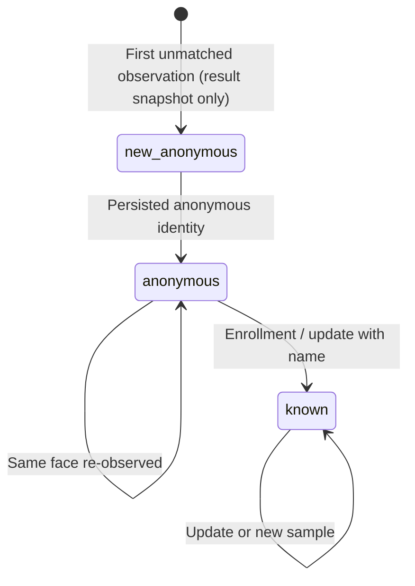

# Phase 1 — Identity and Process Lifecycle

## Persistent Identity State

- `anonymous`: A face was observed, assigned a global `faceId`, and persisted without name/PII.
- `known`: The same `faceId` was enrolled with a non-empty name. Metadata may also be present.

Transitions:

## `new_anonymous` Snapshot Semantics
`new_anonymous` is an immutable recognition result snapshot in `recognition_result.status_snapshot`. It is **not** a persistent identity state. After the first recognition response, the persisted identity is `anonymous`.

## Enrollment
Enrollment reuses the same `faceId`. Historical `recognition_result` rows are never rewritten after enrollment or delete.

## Multi-Sample Identity
One `face_identity` may own many `face_sample` rows. Each sample has its own `sample_id`, MinIO object, and Qdrant point.

## No-Face and Multi-Face
- No-face is a successful result: `face_count=0`, `faces=[]`.
- Multi-face: each detection is an independent result row with a unique `(process_id, detection_ordinal)`.

## Process Tracking
- Every API request receives a UUIDv7 `process_id`.
- `process_record` tracks type, status, face count, and completion.
- `process_event` records sanitized milestones. Event logging is best-effort; process/result traceability is mandatory.

## Delete Behavior
Soft-delete/inactive lifecycle. Relational history (`face_identity`, `face_sample`, `recognition_result`, `process_event`) is retained. Active samples/vectors are disabled; binary evidence cleanup is explicit via reconciliation.
