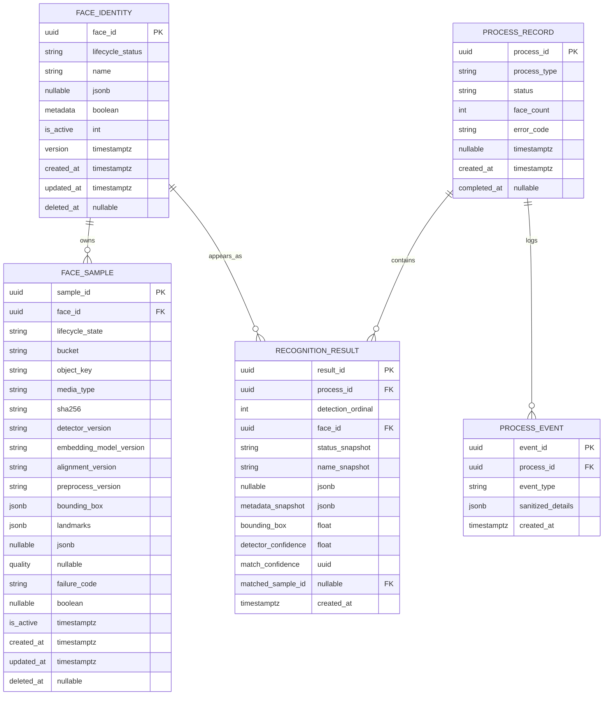

# Phase 1 — PostgreSQL ERD

## Constraints and States

| Table | Check / Unique |
|-------|----------------|
| `face_identity` | `lifecycle_status IN ('anonymous','known')`; known requires non-empty name; anonymous requires name NULL and metadata `'{}'`; `(lifecycle_status, is_active)` index |
| `face_sample` | `lifecycle_state IN ('pending','blob_ready','indexed','active','inactive','failed')`; `(bucket, object_key)` unique; FK to `face_identity` |
| `process_record` | `process_type IN ('recognize','enroll','update','delete')`; `status IN ('started','completed','failed')` |
| `recognition_result` | `(process_id, detection_ordinal)` unique; `status_snapshot IN ('known','anonymous','new_anonymous')`; immutable after insert |
| `process_event` | FK `process_record` CASCADE; best-effort log |

## Requirement-to-Column Mapping

| Requirement | Tables / Columns |
|-------------|------------------|
| Persistent faceId | `face_identity.face_id` |
| Anonymous vs known | `face_identity.lifecycle_status`, `name`, `metadata` |
| Multiple samples per face | `face_sample.face_id FK` |
| Process trackability | `process_record.process_id`, `status`, `face_count` |
| Process logging | `process_event.process_id`, `event_type`, `sanitized_details` |
| History / immutable snapshots | `recognition_result.*`, no UPDATE API |
