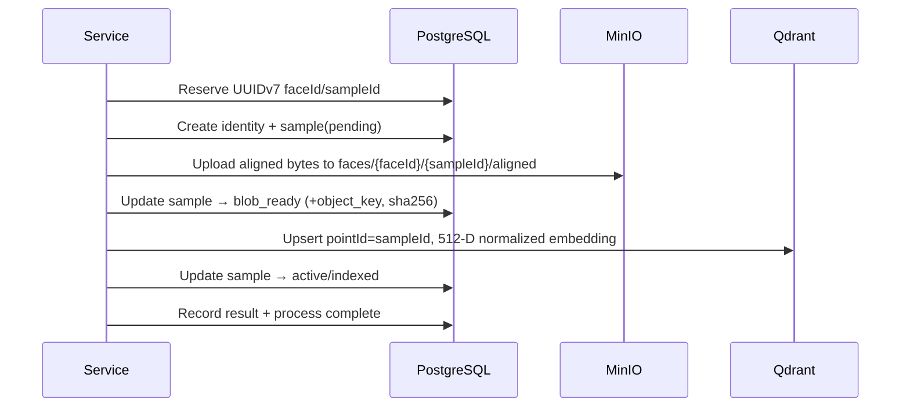

# Phase 1 — Cross-Store Lifecycle

## Principle
PostgreSQL, MinIO and Qdrant do **not** share a transaction. The Service implements an explicit staged workflow bracketed by PostgreSQL lifecycle states.

## Happy Path

## Retry and Idempotency
- Reserved UUIDv7 IDs are reused across retries.
- MinIO upload is idempotent; SHA-256 is rechecked.
- Qdrant upsert is idempotent by point ID.
- Repository methods never commit; Service owns transaction boundaries.

## Failure Branches

| Stage | Failure | Effect | Compensation / Event |
|-------|---------|--------|----------------------|
| Identity/sample insert | PG error | No mutation | `failed` process record + event |
| MinIO upload | Storage error | Sample remains `pending` | sanitized event, retry later |
| MinIO stat/checksum | SHA mismatch | Sample marked `failed` | sanitized event |
| Qdrant upsert | Vector error | Sample remains `blob_ready` | sanitized event, retry later |
| PG finalization | PG error | Qdrant may have point; sample not `active` | reconciliation detects mismatch |

## Reconciliation
`StorageReconciliationService` inspects PostgreSQL, MinIO, and Qdrant and reports:

- Sample `active` but object missing.
- Sample `active` but vector missing.
- Object exists without PostgreSQL sample.
- Vector exists without PostgreSQL sample.
- Payload/version mismatches.

Dry-run mode reports only; mutation mode repairs with explicit Service approval.

## No UnitOfWork / Distributed Transaction
No `UnitOfWork` class, no saga framework, no two-phase commit. Transaction boundaries are normal SQLAlchemy sessions managed by the Service; external stages are explicit and inspectable.
